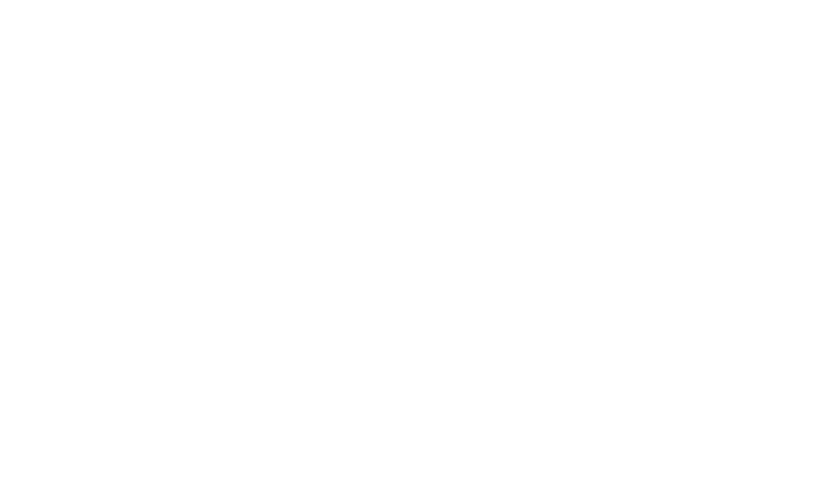
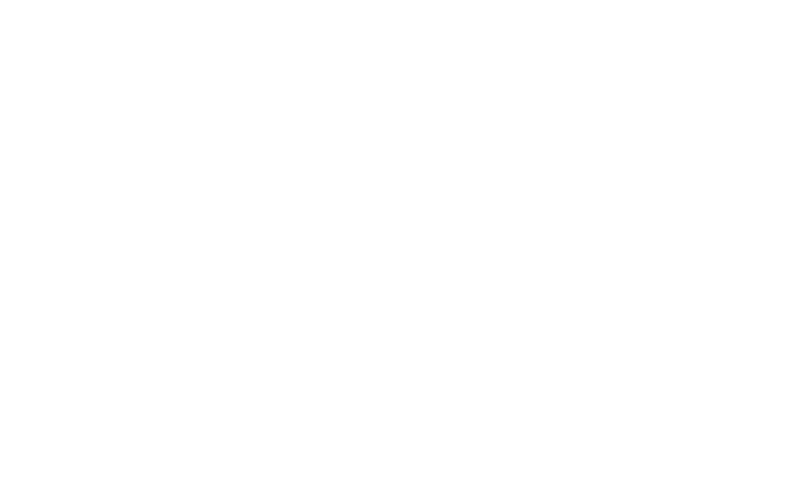
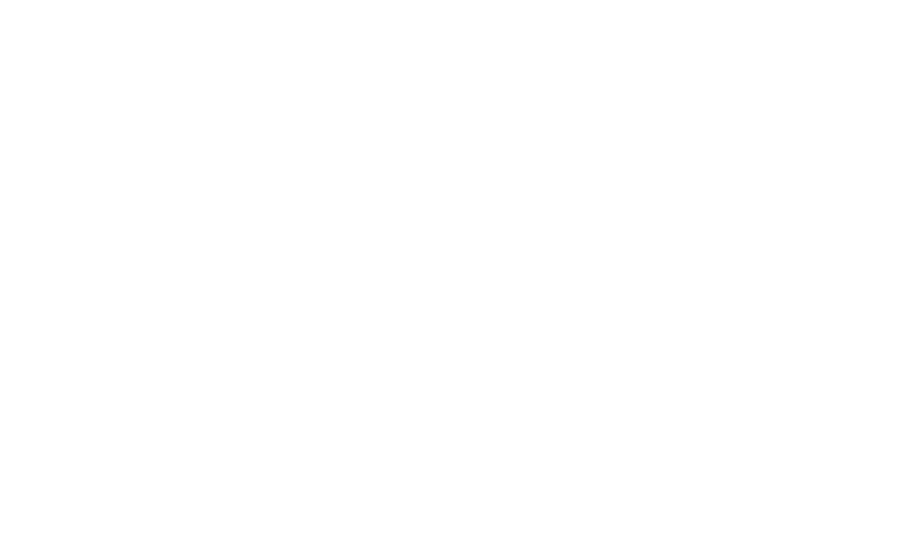

# Análise Exploratória de Dados - Sample Superstore

## Descrição do Projeto

Este projeto foi desenvolvido como atividade avaliativa do módulo de Introdução ao Data Science do programa SCTEC - Carreira Tech.

O objetivo principal deste projeto é realizar uma Análise Exploratória de Dados (AED) utilizando Python e bibliotecas do ecossistema de Data Science, buscando identificar padrões, tendências e insights relevantes a partir do dataset "Sample Superstore".

---

## Objetivos da Análise

Durante o projeto foram realizadas etapas fundamentais do fluxo de análise de dados, incluindo:

- Carregamento dos dados
- Tratamento e preparação dos dados
- Exploração inicial da base
- Análise Exploratória de Dados (AED)
- Criação de visualizações gráficas
- Geração de insights
- Conclusão analítica

---

## Tecnologias e Bibliotecas Utilizadas

- Python
- Pandas
- NumPy
- Matplotlib
- Seaborn
- Jupyter Notebook
- VSCode

---

## Dataset Utilizado

O dataset utilizado neste projeto foi o "Sample Superstore", amplamente utilizado para estudos e práticas de análise de dados e visualização.

O conjunto de dados contém informações sobre:
- vendas;
- lucro;
- descontos;
- categorias de produtos;
- segmentos de clientes;
- regiões;
- datas de pedidos.

---

## Estrutura do Projeto

```text
Projeto_Data_Sciense/
│
├── data/
│   └── SampleSuperstore.csv
│
├── notebooks/
│   └── analise_superstore.ipynb
│
├── images/
│
├── docs/
│   └── README.md
│
├── requirements.txt
├── .gitignore
└── venv/
```

---

## Principais Etapas Desenvolvidas

### 1. Carregamento dos Dados

Leitura do dataset CSV utilizando a biblioteca pandas.

### 2. Tratamento dos Dados

Foram realizados:
- tratamento de datas;
- verificação de valores nulos;
- verificação de duplicados;
- padronização das colunas.

### 3. Análise Exploratória de Dados

Durante a AED foram analisados:
- vendas por categoria;
- lucro por categoria;
- vendas por segmento;
- relação entre desconto e lucro;
- evolução temporal das vendas;
- correlação entre variáveis.

### 4. Visualizações Gráficas

Foram criados gráficos utilizando Matplotlib e Seaborn para auxiliar na interpretação dos dados.

### Boxplot de Vendas


### Boxplot do Lucro


### Vendas por Categoria



### Lucro por Categoria



### Vendas por Segmento


### Dispersão entre Desconto e Lucro


### Evolução Temporal das Vendas


### Correlação entre Variáveis



---

## Principais Insights

- A categoria Technology apresentou o maior volume de vendas e forte lucratividade, demonstrando elevado potencial estratégico para o negócio.
- O aumento dos descontos apresentou impacto negativo sobre o lucro, indicando possível comprometimento da rentabilidade em políticas agressivas de desconto.
- O segmento Consumer foi responsável pela maior participação nas vendas totais da empresa.
- A análise temporal permitiu identificar tendências de crescimento nas vendas ao longo do período analisado.

---

## Conclusão

O projeto possibilitou aplicar conceitos fundamentais de Data Science e Análise Exploratória de Dados, permitindo compreender melhor o comportamento comercial da empresa através da interpretação dos dados.

Além disso, o desenvolvimento do projeto contribuiu para o aprendizado prático de Python, manipulação de dados, visualização gráfica e geração de insights analíticos.

---

## Como Executar o Projeto

### 1. Clonar o repositório

```bash
git clone URL_DO_REPOSITORIO
```

### 2. Criar ambiente virtual

```bash
python -m venv venv
```

### 3. Ativar ambiente virtual

#### Windows

```bash
.\venv\Scripts\Activate.ps1
```

### 4. Instalar dependências

```bash
pip install -r requirements.txt
```

### 5. Executar o Jupyter Notebook

```bash
jupyter notebook
```

---

## Autor

William Moura